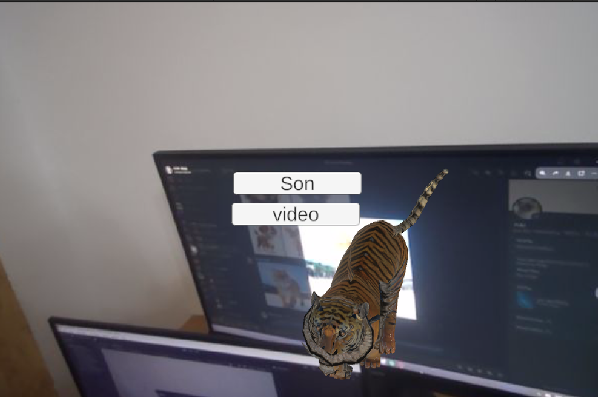
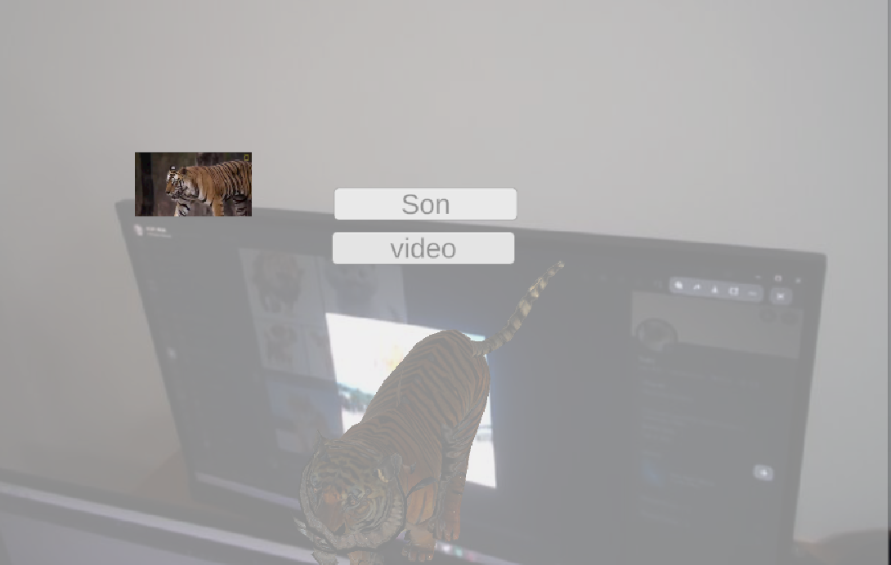

# Vuforia Unity AR Application

An augmented reality application built with Unity and the Vuforia engine that recognizes specific tiger and cat images and displays interactive 3D models with multimedia controls.

## Overview

This AR application uses image recognition to identify tiger or cat reference images. When a target image is detected, the corresponding 3D model appears with two interactive buttons for playing sounds and viewing additional images.

## Features

- 🎯 **Image Target Recognition** - Detects predefined tiger and cat images using Vuforia
- 🐅 **3D Model Rendering** - Displays animated tiger or cat models in augmented reality
- 🔊 **Audio Playback** - Button-triggered animal sounds (roar/meow)
- 🖼️ **Image Gallery** - Button-activated display of additional animal photographs
- 📱 **Mobile AR** - Optimized for smartphone and tablet devices

## Screenshots

| Tiger Model with Controls | Tiger Video Playback |
|---------------------------|---------------------|
|  |  |

## How It Works

1. Point your device camera at a recognized tiger or cat reference image
2. Vuforia identifies the image target and triggers the corresponding AR content
3. A 3D model of the animal appears anchored to the target image
4. Two UI buttons appear alongside the model:
   - **Sound Button** - Plays the animal's distinctive call
   - **Gallery Button** - Opens an image viewer with more photos

## Requirements

- Unity 2022.3.62f3 or later
- Vuforia Engine package
- Android/iOS build support
- AR-compatible mobile device

## Setup

1. **Import Vuforia Engine** via Unity Package Manager
2. **Configure Vuforia** with your license key from the Vuforia Developer Portal
3. **Add Image Targets** using your Vuforia Target Manager database
4. **Import 3D models** and audio files into your Unity project
5. **Build and deploy** to your target platform

## Usage

1. Build and install the application on your mobile device
2. Launch the app and grant camera permissions
3. Point your camera at a registered tiger or cat image
4. Watch the AR model appear and interact using the on-screen buttons

## Vuforia Target Setup

- Create a database in the [Vuforia Target Manager](https://developer.vuforia.com/target-manager)
- Upload reference images (tiger/cat photos)
- Download and import the database Unity package
- Assign image targets in your scene

## Contributing

This is a personal project, but suggestions and improvements are welcome. Feel free to open an issue or reach out.

---

*Built with Unity and Vuforia.*
